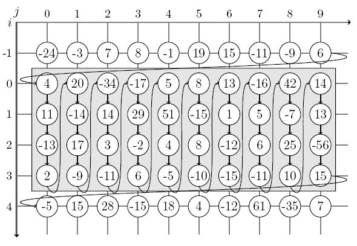

# JPEG 2000

GOSSET Séverin - BIGUENET Denis
Université Paris-Est Marne-la-Vallée

## Abstract
### Problème étudié

L’un des formats d’image le plus répandu est le format JPEG (<i>Joint Photographic Expert Group</i>), très utilisé pour la compression d’images, notamment de photographies. En l’an 2000, une variante du JPEG a été mise au point : le JPEG2000. Tout comme le JPEG, il s’agit d’une méthode compression qui peut-être avec ou sans perte.

### Pertinence

Le format JPEG2000 a pour but de compresser plus efficacement une image que le JPEG. Le JPEG2000 a donc pour avantage de proposer une meilleure qualité d’image pour des taux de compression très élevé, malgré tout, la différence entre JPEG et JPEG2000 sur des taux de compression moins imporants est faible.

### Solution Proposée

Tandis que le format JPEG utilise une transformée en cosinus discrète, le format JPEG2000 s’appuie sur une transformée en ondelettes, mais aussi par la sélection de régions d’intérêts  dans l’image.

### Utilité

Aujourd’hui, le format JPEG2000 est relativement peu utilisé sur le Web, il est surtout utilisé dans les milieux professionnels. Il n’est pas utilisé par les appareils photos, n’est souvent pas supporté par les navigateurs internet (sans extensions) et les logiciels l’acceptant ne proposent pas toutes les options de compression, il est donc bien moins populaire que le format JPEG.

## Introduction
### Présentation

L’algorithme du format JPEG2000 se décompose en cinq grandes phases :

1. Le prétraitement

2. La transformée en ondelettes

3. La quantification

4. L’encodage

5. Le post-traitement

### Algorithme détaillé
#### Transformée en ondelettes discrète

La transformée en ondelette utilise deux filtres pour séparer les hautes fréquences de l’image des basses. Une convolution entre les filtres et le signal permet d’effectuer une itération de la transformée. En 2D, ils sont appliqués en hauteur et en largeur, ce qui donne 4 blocs, nommés `LL`, `LH`, `HL`, et `HH` : `L` pour low, les basses fréquences, et `H` pour high, les hautes fréquences. La première lettre correspond au filtrage horizontal et la deuxième au filtrage vertical. La convolution est ensuite réappliquée en boucle sur le bloc `LL` pour faire autant d’itérations que nécessaire.

{width=50%}

#### Quantification

La quantification est une technique de compression avec pertes, le principe est de représenter l’image avec moins de bits.
L’une des méthodes pour quantifier une image est la bit plane compression.
Sur une image en niveaux de gris, chaque valeur de pixel est convertie en binaire, pour chaque valeur binaire, on extrait le bit correspondant (par exemple le bit de poids fort), on obtient alors une nouvelle image dont chaque pixel vaut 1 si le niveau de gris était supérieur ou égal à 128 et 0 sinon. Ensuite, l’image est redimensionnée pour avoir N lignes de 8 colonnes. Pour terminer, chaque ligne est convertie en un entier. Lors de cette compression avec un seul bit, on perd 7/8e de l’information, mais la taille de l’image compressée ne vaut qu’1/8e de celle de l’image d’origine. Cependant, il est possible d’effectuer cette compression avec plusieurs bits.

#### Encodage

L’encodage des coefficients de l’image est séparée en 2 parties : le codage par plan de bits, et le codage arithmétique du résultat.

##### Codage par plan de bits (EBCOT)

L’algorithme EBCOT (<i>Embedded Block Coding with Optimal Truncation Points</i>) est un codeur par plan de bits. Le principe est de considérer chaque coefficient comme un chiffre, et de coder sa « signifiance » sur chaque plan, c’est a dire s’il dispose d’un bit à 1 sur ce plan ou pas.

Afin de coder ces informations, on utilise un algorithme en plusieurs passes sur l’image divisée en blocs. On détermine le nombre de plan en prenant le coefficient avec la plus grande valeur absolue, afin de connaître le nombre de bits maximum pour les coefficients de l’image. Pour chaque plan de bits, on va utiliser 3 passes : la passe de propagation de la signifiance, qui va permettre de coder les coefficients voisins de coefficients signifiants aux plans de bits précédents, la passe d’affinage de l’amplitude, qui va permettre de coder les coefficients signifiants au plan de bits précédents, et enfin la passe de nettoyage, qui va permettre de coder les coefficients encore non codé sur ce plan de bits par les deux premières passes. Sur le plan de bits le plus haut, comme aucun coefficient n’est signifiants aux plan précédents, seule la passe de nettoyage est utilisée.

Chaque passe de l’algorithme est appliquée sur un bloc, colonnes par colonnes, et va émettre un résultat en fonction du coefficient. Ce résultat est composé d’une part d’un bit (0 ou 1), et d’un contexte, qui permet d’estimer le voisinage de chaque bits et qui servira pour la suite de l’algorithme.

Cette suite de couples est ensuite envoyée à un codeur entropique, MQ-codec.

#### Codage entropique (MQ-codec)

Le codage entropique MQ-codec consiste à coder un texte, à partir de la probabilité d’apparition de chaque caractère, et d’un intervalle construit à partir de ces probabilités. L’intervalle [0, 1[ est découpé en intervalles proportionnels à la probabilité qu’un caractère apparaisse dans le texte.

Cet intervalle est utilisé pour coder un nombre flottant, qui représentera le texte à encoder. L’algorithme consiste à modifier, à chaque lettre du texte à encoder, l’intervalle [0, 1[ pour ne garder à la fin qu’un intervalle ne pouvant représenter le que le texte à encoder. Il suffit ensuite de choisir un nombre dans cet intervalle, qui encodera le texte.

Pour la décompression, le principe est similaire, on se sert des probabilités, du même intervalle découpé que pour la compression, et du nombre flottant qui appartenait à l’intervalle représentant le texte. L’algorithme consiste ensuite à reconstruire le mot à partir du flottant et des intervalles.

Le résultat de l’algorithme EBCOT Tier 1 est envoyé à ce codeur, les bits étant le texte à compresser et les contextes servant à déterminer les probabilités.

Si l’algorithme permet en théorie de calculer tout le texte en un seul nombre, la précision nécessaire dans les flottants le rend inutilisable sur plus d’une quinzaine de lettres, c’est pourquoi on encode par blocs.

## Améliorations possibles

Ces étapes sont optionnelles, et peuvent servir à améliorer l’algorithme du JPEG2000.

### Transformations des couleurs vers YUV

Si l’image de base est en couleurs, il peut être intéressante de transformer son espace colorimétrique en $Y’UV$. Cet espace est défini par une luminance $Y’$, et deux chrominances $U$ et $V$. 

La luminance $Y$ est définie comme $R + B + G$, et les chrominances $U$ et $V$ sont définies par : $U = B - Y$ et $V = G - Y$.

Il est également nécessaire d’effectuer une correction gamma sur les coefficients, pour obtenir l’espace $Y’UV$.

### Tiling 

Le <i>tiling</i> permet de diviser une image en plusieurs blocs de même taille. Cette technique peut être utilisée notamment pour les grandes images, puisque chaque bloc peut être traité séparément du reste.

### Regions of interest (ROI)

La région d’intérêt est une amélioration permettant de minimiser la perte de détails dans une région précise de l’image. Cependant, cette amélioration implique de perdre des détails dans les autres régions, qui sont alors plus compressées que sans la ROI.
Il existe deux méthodes pour la région d’intérêt :

 - Sélection par l’utilisateur

 - Détection automatique des zones de détails par une IA

## Conclusion

TODO

## Bibliographie
### Jpeg 2000
https://www2.ulb.ac.be/cours/acohen/travaux_2006_infodoc/CompressionNumerique/TypeDonneesImageJPEG2000.htm
https://www2.ulb.ac.be/cours/acohen/travaux_2006_infodoc/CompressionNumerique/TypeDonneesImageJPEG.htm#Le_JPEG
https://web.stanford.edu/class/ee398a/handouts/lectures/10-JPEG2000.pdf
http://ljk.imag.fr/membres/Valerie.Perrier/SiteWeb/node13.html

### RGB to YUV
https://stackoverflow.com/questions/17892346/how-to-convert-rgb-yuv-rgb-both-ways
https://fr.wikipedia.org/wiki/YUV

### Quantification
https://www.whydomath.org/node/wavlets/jpeg2000quantization.html
https://www.imageeprocessing.com/2015/10/bit-plane-compression.html

### EBCOT Tier 1
http://d.xav.free.fr/ebcot/

### MQ-Coder
https://xavirema.eu/mq-coder-in-matlab/